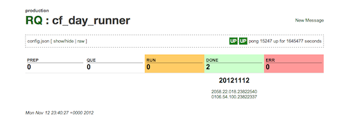

# RQ

RQ is a **simple** queueing/messaging system for *any* Unix system and can process
messages in **any language**.
It is designed to run on every machine in your distributed system.
Think of it as another one of those small, but
important services (like crond). It uses directories and json text files on the Unix filesystem
as its database. It does not use a specialized database. As a result, it is easy to
understand and debug.

Each item in the queue is a **Message**. Messages can be small, but RQ was designed for a medium to large granularity.
For example, messages could have attachments with 100s to 1000s of megabytes.
Each message can be processed by the local machine or relayed reliably to another
machine for processing. These machines don't have to be in the same data center and in fact can be on another continent. When a message is received in a queue, a worker process is started to process the message. The worker process is one-to-one with a unix process. (some call
this a 'forking' model). The code required to implement a worker is very small. Also, API is compatible with any language that runs on Unix. While a worker is processing a message, you can
view a real-time display of logs (with ANSI colors) via the browser.

It has been used in production since 2009 and processed billions of messages at brightroll.
It has a full test suite that verifies the system.

In the future, there is a goal of building a version that uses a single consistent store (something like MongoDB).

Here is a sample screenshot of a single queue:



## A brief overview of the system.
Once RQ is installed, the user creates a queue. The queue requires only a few
parameters, but the most important one is the 'queue script'. This is a program
written in *any* language that will process each message. The API for the queue
script is easy to
implement and described below. Whenever a message is received on that queue,
this program runs. The program will either succeed, fail, or ask to retry *x* seconds in
the future. If the script takes a long time to run, it can send periodic updates
to RQ to indicate progress. The script can also provide a lot of logging
and produces large files as output.

The RQ system provides a REST, HTML, cmd-line, or low-level socket
API to work with messages and queues. That is all there is to it.

When would you use RQ?
In a typical web application, you should always respond to the browser within a small
time frame (say under 1 seconds). You should also avoid using a lot of memory in this section
of your application stack as well. If you know a particular computation will exceed
those requirements, you should hand off the task to a queueing system.

If you have scripts that run via cron, you should probably run that under RQ. In this scenario, RQ will monitor that the script properly executed.

Here are some examples:

* Transcoding a video file (high cpu)
* Implement a large query for a user in the background
* Have a queue for curl requests for URLs passed in
* A processing pipeline of files stored in S3 (light map/reduce)
  * retrieve
  * filter
  * reduce
  * sftp to partner
* Deploy an update to systems all over the world for user-facing web app (high latency)
* Periodically rotate and send HTTP logs to a NOSQL database for search and analysis
* Verify URLs with Internet Explorer (and take screenshots) on a box controllable via a simple web api
* Spin up EC2 instances via AWS api


## Small Dose of Philosophy
The people behind RQ have been working on Unix since the late 1980's. The focus
of RQ has been on reliability and the ease of understanding. The author prefers
systems that allow him to sleep soundly at night, and he thinks the design of
RQ allows him to achieve this. There is a lot to talk about here and why the existing
systems didn't solve the problem. If you are interested in that, read the full
philosphy section below.

Also, if you were on the internet in the 80s or 90s, you will see that this system bears some resemblance to the UUCP system deployed back then. It was definitely an inspiration for the design of this system.


Table Of Contents
-----------------

* [Quick Setup](#section_Quick_Setup)
* [Features](#section_Features)
* [Hip Tips](#section_Hip_Tips)
* [Queue Config Vars](#section_Queue_Config_Vars)
* [Guarantees](#section_Guarantees)
* [Your First Queue Script](#section_Your_First_Queue_Script)
  * [Ruby](#section_Ruby)
  * [Bash](#section_Bash)
* [Debugging In Production](#section_Debugging_In_Production)
* [Queue Script Api](#section_Queue_Script_Api)
  * [Environment](#section_Environment)
  * [Logs and Attachments](#section_Logs_and_Attachments)
  * [Pipe Protocol](#section_Pipe_Protocol)
* [RQ Server API](#section_RQ_Server_API)
  * [REST](#section_REST)
  * [cli](#section_cli)
  * [Unix Domain Sockets](#section_Unix_Domain_Sockets)
* [Special Queues](#section_Special_Queues)
* [Patterns](#section_Patterns)
  * [Ruby on Rails](#section_Ruby_on_Rails)
  * [Master Script](#section_Master_Script)
  * [Deploying Code](#section_Deploying_Code)
  * [Webhooks](#section_Webhooks)
* [For The Ops People](#section_For_The_Ops_People)
  * [Monitoring](#section_Monitoring)
  * [Queue States](#section_Queue_States)
  * [Deploying Code](#section_Deploying_Code)
* [For The QA People](#section_For_The_QA_People)
* [Internals](#section_Internals)
  * [Persistence](#section_Persistence)
  * [Relay](#section_Relay)
* [FAQ](#section_FAQ)
* [Philosophy](#section_Philosophy)
* [History](#section_History)
* [Future](#section_Future)
* [Contributors](#section_Contributors)


<a name='section_Quick_Setup'></a>
## Quick Setup

You will need:

1. Source to RQ
1. A unique FQDN for the system (if running in production).

Clone the github repo.

1. Run `./bin/rq-install`. You probably want to add `--tmpdir`, since it defaults to `/rq/tmp`. Other useful options include `--host` and `--env`.
1. Run `./bin/rq-mgr start`.

This will set up the RQ directory system and a few default queues. It will also start 1 rq-mgr process, one rq process per queue, and the web interface.

For production use, copy `bin/rc.rq` to your init scripts directory.

<a name='section_Features'></a>
## Features

<a name='section_Hip_Tips'></a>
## Hip Tips

* Scripts should be idempotent if at all possible. You should assume that
* Messages should not go to error frequently
  * RQ can retry a message if the error is transient. let you kno. If this is happening, something is wrong with your assumptions.
* Do not fire and forget an RQ message.
  * It is ok to be more lax in side of the queue script that processes that message
* Log output that might help someone other than you diagnose the issue
* Crypto - sign and encrypt your message before giving it to RQ. Secure channels is too hard of a problem.
* Use the status system for progress updates
* Do not run RQ in production with the name 'localhost'
* Master passing.Do not access other message directories unless the message is `done`
* Don't take too long via the Web UI, there is a X second timeout

<a name='section_Queue_Config_Vars'></a>
## Queue Config Vars

RQ Queue Config JSON

A typical config:

``` json
{"name":"relay","script":"./code/relay_script.rb","num_workers":1,"exec_prefix":""}
```


** Mandatory Fields **

name:
Name of the queue.

script:
The path to the script that will process messages in that queue

num_workers:
The number of processes that can run to handle incoming messages. This
is equivalent to the max number of messages that can be in the run state.
Default: 1

Optional Fields
exec_prefix:
This is what is prefixed to the script before the 'exec' system call is made to run the "script". As a default, it is set to 'bash -lc ' if not set. Note the space on the end.

env_vars
This is a map of key value pairs that will be established in the environment per script run.

<a name='section_Guarantees'></a>
## Guarantees

* Messages cannot be guaranteed to be delivered in order
* Messages are unique per machine and should use the unique host name
* Messages can be guaranteed to be delivered intact when relayed (MD5)
* RQ will not respond with an OK if a message cannot be commited to disk
* Queue Scripts that are referenced via symlinks are resolved to their full path before execution
  * (This is especially helpful when you have scripts running and you deploy a new version)
* Files are consistent

It *tries* hard to

- insure message is in identical state every run

- avoid duplicate messages
  aka - there is a small chance that messages might be duplicated.

It *does not try* hard to guarantee ordering
  - messages might come in out-of-order. this may happen as a result
    of a failure in the system or operations repointing traffic
    to another rq

given the above, use timestamp versioning to insure an older message
doesn't over-write a newer message. if you see the same timestamp again
for a previously successful txn, it might be that ultra-ultra rare duplicate,
so drop it.

- You must exit properly with the proper handshake.


<a name='section_Your_First_Queue_Script'></a>
## Your First Queue Script

When developing an RQ script, you should have a problem in mind that requires just a few parameters.

Next you develop a script. You can skip down just a bit to see some examples.

Typically, you will setup RQ on your development enviornment. Then you will setup a `queue` for your particular
script. Then via the web UI, you will create a new message and submit it. In another tab, you can hit refresh
to the state of the message. If it succeeds, you are done. If not, just edit the code, hit refresh on the tab
that created the message (to resubmit the form and create a new test message), and check on the queue to see if it worked.

Essentially, this turns into a


<a name='section_Ruby'></a>
### Ruby

``` ruby
#!/usr/bin/env ruby

# NOTE: Ruby buffers stdout, so you must fflush if you want to see output
#       in the RQ UI

end

def write_status(state, mesg = '')
  io = IO.for_fd(ENV['RQ_PIPE'].to_i)
  msg = "#{state} #{mesg}\n"
  io.syswrite(msg)
end

write_status('run', "just started")
sleep 2.0

log(cwd)

log(ENV.inspect)

write_status('run', "pre lsof")
log(`lsof -p $$`)
write_status('run', "post lsof")

5.times do
  |count|
  log("sleeping")
  write_status('run', "#{count} done - #{5 - count} to go")
  sleep 1.0
end
log("done sleeping")


log("done")
write_status('done')
exit(0)
```

<a name='section_Bash'></a>
### Bash

Here is a BASH script sample. Yes, even a bash script can handle RQ messages (which was surprising to me!)
The main drawback with BASH as an RQ script is how it deals with functions. I would only use it for
fairly simple scripts.


``` bash

#!/bin/bash

# File Descriptor #3 is pipe back up to RQ parent watcher process
function write_status {
  echo $1 $2 >&3
}


write_status 'run'  "just started"

echo "TEST TEST TEST"

pwd

if [ "$RQ_PARAM1" == "html" ]; then
  echo "html unsafe chars test"
  echo "<HTML "UNSAFE" 'CHARS' TEST & OTHER FRIENDS>"
  echo ""
fi

env | grep RQ_

echo "----------- all env ---------"
env
echo "-----------------------------"

lsof -p $$

write_status 'run' "post lsof"

if [ "$RQ_PARAM1" == "slow" ]; then
  echo "This script should execute slowly"
  write_status 'run' "start sleeping for 30"
  sleep 30
  write_status 'run' "done sleeping for 30"
fi

if [ "$RQ_PARAM1" == "slow1" ]; then
  echo "This script should execute slowly"
  write_status 'run' "start sleeping for 1"
  sleep 1
  write_status 'run' "done sleeping for 1"
fi

if [ "$RQ_PARAM1" == "slow3" ]; then
  echo "This script should execute slowly"
  write_status 'run' "start sleeping for 3"
  sleep 3
  write_status 'run' "done sleeping for 3"
fi

if [ "$RQ_PARAM2" == "err" ]; then
  echo "This script should end up with err status"
  write_status 'err' "by design"
  exit 0
fi

if [ "$RQ_PARAM1" == "dup_direct" ]; then
  # Todo: need something better than a free roaming rm
  rm -f "$RQ_PARAM2"
  echo "This script should create a duplicate to the test_nop queue"
  write_status 'run' "start dup"
  write_status 'dup' "0-X-test_nop"
  read_status
  echo "Got: [${RETURN_VAR[@]}]"

  if [ "${RETURN_VAR[0]}" != "ok" ]; then
    echo "Sorry, system didn't dup test message properly : ${RETURN_VAR}"
    echo "But we exit with an 'ok' the result file won't get generated"
  fi

  if [ "${RETURN_VAR[0]}" == "ok" ]; then
    # Old school IPC
    echo "${RETURN_VAR[1]}" > "$RQ_PARAM2"
  fi
  write_status 'run' "done dup"
fi

if [ "$RQ_PARAM1" == "dup_fail" ]; then
  # Todo: need something better than a free roaming rm
  rm -f "$RQ_PARAM2"
  echo "This script should create a duplicate to a non-existent queue"
  write_status 'run' "start dup"
  write_status 'dup' "0-X-nope_this_q_does_not_exist"
  read_status
  echo "Got: [${RETURN_VAR[@]}]"
  # Old school IPC
  echo "${RETURN_VAR[@]}" > "$RQ_PARAM2"
  write_status 'run' "done dup"
fi

if [ "$RQ_PARAM1" == "resend1" ]; then
    if [ "$RQ_COUNT" == "0" ]; then
        echo "This script should resend the current job at a new time"
        write_status 'resend' "2"
        exit 0
    fi
fi

if [ "$RQ_PARAM1" == "resend2" ]; then
    if [ "$RQ_COUNT" -lt 6 ]; then
        echo "This script should resend the current job at a new time"
        echo "count: ${RQ_COUNT}"
        write_status 'resend' "0"
        exit 0
    fi
fi

if [ "$RQ_PARAM2" == "resend1" ]; then
    if [ "$RQ_COUNT" == "0" ]; then
        echo "This script should resend the current job at a new time"
        write_status 'resend' "8"
        exit 0
    fi
fi

if [ "$RQ_PARAM1" == "symlink" ]; then
  echo "This script should end up with a done status"
  echo $0
  write_status 'done' "${0}"
  exit 0
fi

echo "done"
write_status 'done' "done sleeping"
```

<a name='section_Debugging_In_Production'></a>
### Debugging In Production

Errors do happen in production in ways we cannot anticipate.

For example, you may
Here is a BASH script sample. Yes, even a bash script can handle RQ messages (which was surprising to me!)
The main drawback with BASH as an RQ script is how it deals with functions. I would only use it for
fairly simple scripts.

<a name='section_Queue_Script_Api'></a>
## Queue Script Api

<a name='section_Environment'></a>
### Environment

When a queue has a message to process, and a slot is available to run, the queue script
will be executed in a particular environment. This environment passes information about the message
to the script via two ancient forms of Interprocess Communication: Environment variables and the filesystem.

Current Dir = <que>/<state>/<short msg id>/job/

Full Msg ID = host + q_name + msg_id

ENV["RQ_SCRIPT"]     = The script as is defined in config file
ENV["RQ_REALSCRIPT"] = The fully realized path (symbolic links followed, etc)
                       Should be equivalent to ARGV[0]

ENV["RQ_HOST"]       = Base URL of host (Ex. "http://localhost:3333/")
ENV["RQ_HOSTNAMES"]  = Base URLs of host (aliases) (Ex. "http://localhost:3333/ http://butter:1234/")
                       Split by space

ENV["RQ_DEST"]       = Msg Dest Queue (Ex. http://localhost:3333/q/test/)

ENV["RQ_DEST_QUEUE"] = Just Queue Name (Ex. 'test')

ENV["RQ_MSG_ID"]     = Short msg id (Ex. "20091109.0558.57.780")

ENV["RQ_FULL_MSG_ID"] = Full msg id of message being processed
                       (Ex. http://vidxcode27.vbtrll.com:3333/q/test/20091109.0558.57.780)

ENV["RQ_MSG_DIR"]    = Dir for msg (Should be Current Dir unless dir is changed
                       by script)

ENV["RQ_PIPE"]       = Pipe FD to Queue management process

ENV["RQ_COUNT"]      = Number of times message has been relayed or processed

ENV["RQ_PARAM1"]     = param1 for message
ENV["RQ_PARAM2"]     = param2 for message
ENV["RQ_PARAM3"]     = param3 for message
ENV["RQ_PARAM4"]     = param4 for message

ENV["RQ_FORCE_REMOTE"] = Force remote flag

ENV["RQ_PORT"]       = port number for RQ web server, default = 3333

ENV["RQ_ENV"]        = 'production', 'development', 'test', 'stage'
ENV["RQ_VER"]        = version of rq

<a name='section_Logs_and_Attachments'></a>
### Logs and Attachments

<a name='section_Pipe_Protocol'></a>
### Pipe Protocol

<a name='section_RQ_Server_API'></a>
## RQ Server API

<a name='section_REST'></a>
### REST

RQ traditionally runs on port 3333.


<a name='section_cli'></a>
### cli

<a name='section_Unix_Domain_Sockets'></a>
### Unix Domain Sockets

<a name='section_Special_Queues'></a>
## SpecialQueues

`cleaner` - this queue removes old messages
`relay` - this queue sends messages to a separate system
Whenever RQ is given a message that is destined for a separate host, the message actually
goes into this queue.

`rq_router` - this queue handles the 'RQ Router' mode described in the
[For The Ops People](#section_For_The_Ops_People) below.

`webhook` - this queue does webhook notifications for any message that requests it

<a name='section_Patterns'></a>
## Patterns

<a name='section_Ruby_on_Rails'></a>
### Ruby on Rails

Typically, what we have done to run Rails code is to just have the `queue script`
setup the environment and run the `./script/runner` facility that rails provides.

<a name='section_Master_Script'></a>
### Master Script

<a name='section_Webhooks'></a>
### Webhooks

<a name='section_Deploying_Code'></a>
### Deploying Code

<a name='section_For_The_Ops_People'></a>
## For The Ops People

RQ can do a few things that aren't obvious above.

One important topic to cover is the 'RQ Router' mode. In this mode, you basically have
a system or pair of systems set up to process.

<a name='section_Monitoring'></a>
### Monitoring

<a name='section_Queue_States'></a>
### Queue States

<a name='section_Deploying_Code'></a>
### Deploying Code

<a name='section_For_The_QA_People'></a>
## For The QA People

A question that comes up occassionaly is, how do I test an RQ script?

Right now, the best answer is to create a test environment with the RQ server and queue set up.

Then inject messages into the queue and verify that the messages are consumed and processed correctly.

<a name='section_Internals'></a>
## Internals

Currently RQ is written in Ruby.
Ruby definitely has its problems, but overall was an excellent choice.
For more on that decision, see the [History](#section_History) below.

RQ depends heavily on the Unix API.

We use Unix Domain Sockets for the primary RPC mechanism. They work just like TCP sockets, except
we don't have to worry about network security. You rendezvous with the listening process via a
special file on the filessystem. They are better than pipes since they provide 2 way communication.

There are 3 primary systems that make up RQ. The rq-mgr process, the individual rq queue processes, and the
web server process.

The primary process is the rq-mgr process. It sets up a Unix Domain socket and communicates via that for
its primary API. Its
primary function is to watch over and restart the individual rq *queue* processes. It maintains a standard
Unix pipe to the child rq process to detect child death.

Each queue gets its own process. They also communicate . These monitor their queue directories and worker processes. They have
the state of the 'que' queue in memory. It also uses a standard unix pipe to communicate with the rq-mgr.
For queue scripts it maintains.

The web server exists to give RQ a human (HTML) and non-human (REST) interface using the HTTP standard. This makes
it easy to use via a browser, cURL, or with just about any HTTP lib that comes with any language.

<a name='section_Persistence'></a>
### Persistence

The system

<a name='section_Relay'></a>
### Relay

<a name='section_FAQ'></a>
## FAQ

<a name='section_Philosophy'></a>
## Philosophy

When working in distributed systems, you will eventually learn that the system is never 100% available. Yet,
most developers tend to program as if the system is always available.

Here is a great list of many of the types of failures that can occur:

http://aphyr.com/posts/288-the-network-is-reliable

Why do developers work this way? Most of the time, it is just time pressure to get something out the door. Other
times it is just a lack of understanding. Modern systems tend to have many layers and components. It would
be difficult to know them all.

Currently, it takes effort to mitigate these issues. There is some progress, but there isn't a single framework
that handles all of the issues defined above. All to often the solution is to silently ignore the errors.

Another important point to make is that knowledge transfer has not been good here. For example, many people
use Unix now without really knowing the fundamental concepts of the system. There are common idioms and
best practices. For example, when DHH proclaimed to
'cheat' by running ImageMagick in a separate process, this was a huge revelation to the Rails community. Yet,
this was one of the core tenets of Unix from its earliest days.

RQ is  designed to mitigate a large portion of the above. It is a framework for communication and processing
in a distributed system.

Here are some of the tenets of its operation:

* It provides a system where reliable handoff is provided.
* RQ doesn't allow a system to fail silently.
* The system doesn't require 100% availability for messaging to work.
* No single message can take the system down.
* It is language agnostic. Let the right tool for the job be used vs. a specific language or framework.
* It encourages idempotent queue behaviour.
* It uses Unix properly, and allows those who know Unix transparent access to the RQ system.

<a name='section_History'></a>
## History

During my career, it was common to see people rediscover the need for queueing systems over and over again.
Typically, there is a spectrum for queueing systems. On one end there is the high-speed, message bus
type system that runs a stock exchange. On the other end of the spectrum, you could consider email.

Typically, properly implemented queueing systems required serious infrastructure.
In fact, because of performance issues, most of these do not persist to disk.
The high-end ones have complex APIs and usually are designed for small message sizes.

Then there are the home grown systems which are usually implemented on Redis or memcache

Then there are the basic ones that run off of a SQL database.

All of these require external systems to handle the state.

I decided to make several bets:

1. There might be a quadrant for a general purpose, lightweight queue manager that existed per machine
2. The system should be able to move huge files
3. Ruby was a *good enough* systems language
4. The Ruby VM would be much better within a few years
5. The Unix filesystem would be fast enough

However, only a few of these panned out.

At the time, it was the goto language of choice at BrightRoll.
Other languages were considered that were significantly different than Ruby, but didn't seem
appropriate.

* Java - memory footprint is way too high. POSIX support is poor (process control, signals, etc.).
* Python - practically equivalent to Ruby, and most were rubyists
* NodeJS - was not nearly baked, very promissing. They are the only system to get Unix since C.
* Go / Golang - may not have existed. If it did, it surely was not baked.
* Erlang - interesting language under consideration. I really liked the concurrency model, but the
           environment was way too out of our experience zone.
* Lisp, ML, Haskell,  etc. - A lot like Erlang, except without a good concurrency model.
* C - would take way too much time
* C++ - even more time than C

My goals were:

* Get something running
* Should be easy to install (think PHP apps... through the browser)
* Should be easy to update (think Wordpress)
* No dependencies with Ruby (it should just work)

Of all of those, only the first occurred.

Again, Ruby was a good choice.
It was pretty easy to get certain features implemented and into production. The three biggest
drawbacks to ruby were

1. Poor IO support for async IO
2. GEMS. GEM conflicts are a huge problem.
3. Overall speed of the language

- When it was initially developed on Mac OS X, it was immediately discovered that the directories would have
  to be named (.noindex) as the activity of RQ caused a tremendous load on Spotlight.
  Now I do my development of RQ via ssh to a VirtualBOX Ubuntu instance.
- We ran into the GLIBC issue where DNS would no longer round-robin.

Yet, even with these drawbacks, the overall architecture proved to work pretty well. The forking model hides
most of the issues that someone would run into with.

<a name='section_Future'></a>
## Future

* Address weaknesses
  * Performance - Light message throughput is poor due to Unix filesystem performance
  * Distributed Worker Model - balanced systems
  * Stronger API for Queue Scripts based on JSON
  * Better integration with graphite

* Rewrite the components of the system in C
  * This will keep the memory requirements lower than any other system
  * This avoids all of the negatives that Ruby brings when doing systems work
  * Much better system level control and accounting is possible
* Distributed Worker Model with MongoDB
  * Without changing the Queue Script API, have workers check in
    with a cluster of RQ managers
  * These managers use MongoDB for persistent queue state
  * MongoDB provides a highly reliable, single-data center store
* Have another persistent store

<a name='section_Contributors'></a>
## Contributors

Dru Nelson
http://github.com/drudru
@drudru

Aaron Stone
http://github.com/sodabrew
@sodabrew

The overall concepts are very similar to the original UUCP systems that use to span the internet.

The idea for the directory storage was copied from the Qmail architecture by Dan J. Bernstein.

The code for RQ was largely written in-house.

Thanks to the BrightRoll engineers who used the system to help work the bugs out.

http://github.com/TJeezy is largely responsible for making RQ look a lot better.

I looked to resque for inspiration for this documentation. I treat it as a goal that I still
want to achieve.

Good links on Unix Process stuff:

Daemons in unix
http://www.enderunix.org/docs/eng/daemon.php

Good Link on Straight Up, Old Skool Pipes
http://www.cim.mcgill.ca/~franco/OpSys-304-427/lecture-notes/node28.html

Process control
http://www.steve.org.uk/Reference/Unix/faq_2.html

http://en.wikipedia.org/wiki/Process_group
